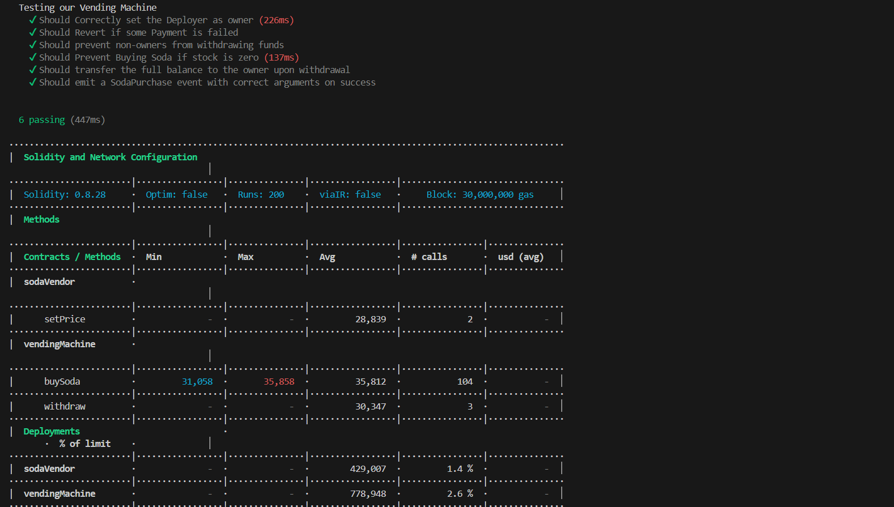

# 🥤 Vending Machine Smart Contract (Hardhat Project)

This project demonstrates a **decentralized vending machine system** built using **Solidity + Hardhat + Ignition**. Users can purchase soda using Ether, while the owner manages funds and inventory securely on the blockchain.

---

## 🚀 Features

- 🧾 Smart contract-based soda purchasing system
- 💰 Secure Ether transactions
- 🔐 Owner-only withdrawal functionality
- 📦 Stock management (prevents buying when out of stock)
- ⚡ Event emission on successful purchase
- 🧪 Fully tested using Hardhat + Chai

---

## 🛠 Tech Stack

- **Solidity** – Smart contract development
- **Hardhat** – Development & testing framework
- **Ethers.js** – Blockchain interaction
- **Hardhat Ignition** – Deployment management
- **Chai** – Assertion library for testing

---

## 📂 Project Structure

```
├── contracts/          # Smart contracts
├── ignition/           # Deployment modules (Ignition)
├── test/               # Test cases
├── scripts/            # Optional scripts
├── hardhat.config.js   # Hardhat configuration
```

---

## ⚙️ Installation

```bash
git clone <your-repo-url>
cd vending-machine
npm install
```

---

## 🧪 Run Tests

```bash
npx hardhat test
```

For gas reporting:

```bash
REPORT_GAS=true npx hardhat test
```

---

## 🧾 Run Local Blockchain

```bash
npx hardhat node
```

---

## 🚀 Deploy Contract (Ignition)

```bash
npx hardhat ignition deploy ./ignition/modules/Deploy.js
```

---

## 📜 Smart Contract Functionalities

### 🛒 Buy Soda

- Users can buy soda by sending exact Ether
- Reverts if:

  - Incorrect payment
  - Stock is empty

### 🔐 Withdraw Funds

- Only owner can withdraw contract balance
- Prevents unauthorized access

### 📦 Stock Handling

- Tracks soda quantity
- Stops purchases when stock = 0

### 📢 Events

- Emits `SodaPurchase` event on successful purchase

---

## 🧪 Test Coverage

Your test suite includes:

- ✔️ Owner validation
- ✔️ Payment validation (revert cases)
- ✔️ Unauthorized withdrawal protection
- ✔️ Stock depletion handling
- ✔️ Balance transfer verification
- ✔️ Event emission testing

(Example test logic implemented using Hardhat fixtures and Chai assertions)

---

## 📌 Example Test Snippet

Refer to the full test file here:

---

## 📈 Future Improvements

- 🧠 Dynamic pricing system
- 📊 Frontend UI (React + Ethers)
- 🔄 Restocking functionality
- 🌐 Deploy on testnet (Sepolia / Goerli)

---

## 🤝 Contributing

Feel free to fork this repo and improve the project!

---

## 📜 License

MIT License

---

## 💡 Author

Ujjwal Kumar
Built with ❤️ using Hardhat & Solidity

---

## 📸 Test Results & Gas Report

<p align="center">
  
</p>
